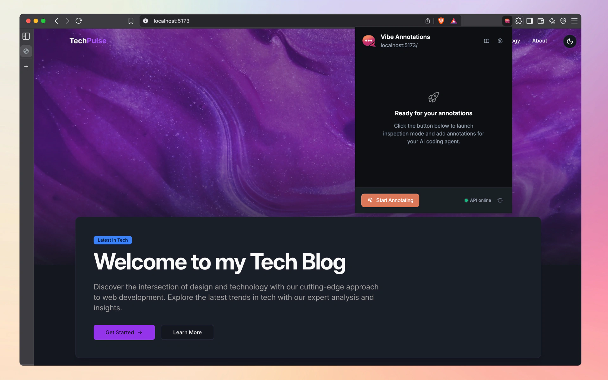
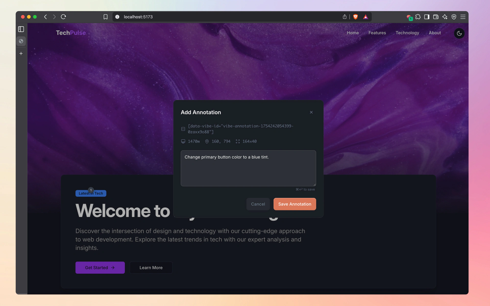
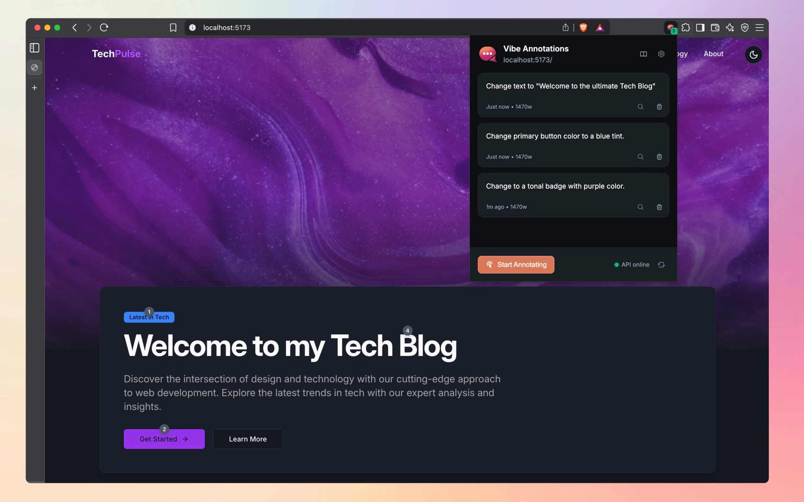
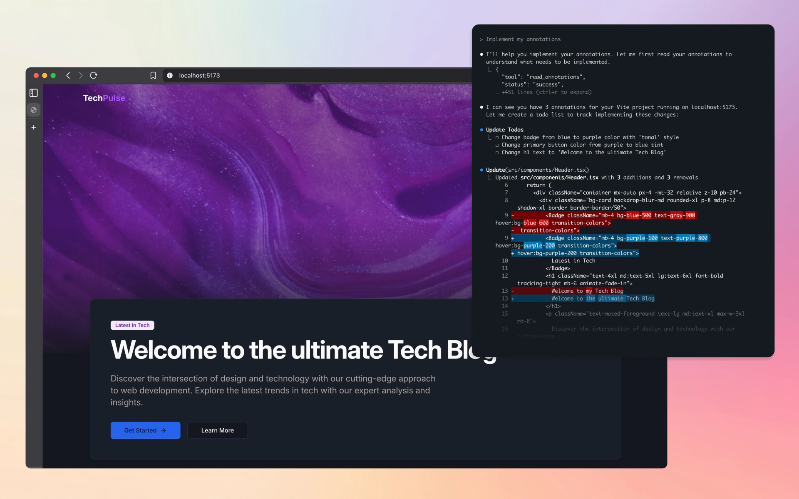

# Vibe Annotations

[](https://opensource.org/licenses/MIT)
[](https://chrome.google.com/webstore)
[](https://github.com/RaphaelRegnier/vibe-annotations-server)
[](CONTRIBUTING.md)

AI-powered development annotations for localhost projects. Drop comments on your localhost apps and let your AI coding agent implement the fixes automatically.

https://github.com/user-attachments/assets/88e9775d-cff2-4013-ba16-8d44feda2674

## How it Works


*1. Extension popup shows setup instructions and current page status*


*2. Click elements on your localhost page to create annotations with feedback*


*3. Manage all your annotations from the extension popup*


*4. AI coding agents automatically implement your requested fixes*

## Features

- 🏠 **Localhost-focused**: Works on your development projects
- 📑 **Multi-page annotations**: Create feedback across multiple routes in your app, then bulk-process all annotations at once for efficient fixes
- 🤖 **AI-powered**: Integrates with AI coding agents via MCP
- ⚡ **Instant feedback**: Click, comment, bulk-fix
- 👨‍💻 **Developer-friendly**: Built for modern web development

## Architecture

Vibe Annotations uses a two-piece architecture:

1. **Browser Extension** (`/extension`): UI, setup guidance, annotation management
2. **NPM Package** (`vibe-annotations-server`): MCP server, local HTTP API, data storage

## Quick Start

### 1. Install the Browser Extension
Go to your chromium browser extension page, and click "Load unpacked" then select /extension directory.

[Coming soon] Install the `vibe-annotations` extension from the Chrome Web Store.

### 2. Install and Start the Server

#### Option A: Using npx (Recommended)
```bash
npx vibe-annotations-server start
```

#### Option B: Global Installation
```bash
# Install globally
npm install -g vibe-annotations-server

# Or install from GitHub directly
npm install -g git+https://github.com/RaphaelRegnier/vibe-annotations-server.git

# Start the server
vibe-annotations-server start
```

### 3. Connect Your AI Coding Agent
Choose your AI coding agent and follow the setup:

#### Claude Code
In your project directory:
```bash
claude mcp add --transport sse vibe-annotations http://127.0.0.1:3846/sse
```

#### Cursor
1. Open Cursor → Settings → Cursor Settings
2. Go to the Tools & Integrations tab
3. Click + Add new global MCP server
4. Add this configuration:
```json
{
  "mcpServers": {
    "vibe-annotations": {
      "url": "http://127.0.0.1:3846/sse"
    }
  }
}
```

#### Windsurf
1. Navigate to Windsurf → Settings → Advanced Settings
2. Scroll down to the Cascade section
3. Add this configuration:
```json
{
  "mcpServers": {
    "vibe-annotations": {
      "serverUrl": "http://127.0.0.1:3846/sse"
    }
  }
}
```

#### VS Code
Install an AI extension that supports MCP, then add this configuration to your MCP settings:
```json
{
  "mcpServers": {
    "vibe-annotations": {
      "type": "sse",
      "url": "http://127.0.0.1:3846/sse"
    }
  }
}
```

### 4. Start Using Annotations
- Open the extension popup for detailed setup instructions
- Start annotating your localhost projects!
- Use your AI coding agent to automatically implement fixes

## User Experience Flow

1. **Extension Installation**: Install from Chrome Web Store
2. **Setup Instructions**: Extension popup guides through terminal setup
3. **Server Detection**: Extension automatically detects running server
4. **Daily Usage**: Create annotations → Use your AI coding agent → Fixes implemented

## Server Management

```bash
# Check server status
vibe-annotations-server status

# Stop server
vibe-annotations-server stop

# Restart server
vibe-annotations-server restart
```

## Uninstalling

### 1. Remove MCP Connection

Remove vibe-annotations from your AI coding agent:

**Claude Code:**
```bash
claude mcp remove vibe-annotations
```

**Cursor/Windsurf/VS Code:**
Remove the vibe-annotations server from your MCP configuration settings.

### 2. Stop and Remove Server

```bash
# Stop the server
vibe-annotations-server stop

# Uninstall the globally installed server
npm uninstall -g vibe-annotations-server
```

**Note:** The server is installed globally regardless of whether you used `npx` or `npm install`.

### 3. Clean Up Data

```bash
# Remove annotation data
rm -rf ~/.vibe-annotations
```

### 4. Remove Browser Extension

Delete the extension from Chrome's extension management page.

## Development

See `/extension` directory for browser extension development. The server package will be published separately as `vibe-annotations-server`.

## Troubleshooting

Having issues? Check our [GitHub Issues](https://github.com/RaphaelRegnier/vibe-annotations/issues) or create a new one.

### Common Issues

- **Server not detected**: Make sure the server is running with `vibe-annotations-server status`
- **Extension not working**: Check that you're on a localhost URL (localhost, 127.0.0.1, or 0.0.0.0)
- **MCP connection failed**: Verify your AI coding agent configuration matches the examples above

## Contributing

We love contributions! Please see our [Contributing Guidelines](CONTRIBUTING.md) for details.

### Contributors

Thanks to everyone who has contributed to making Vibe Annotations better!

<!-- ALL-CONTRIBUTORS-LIST:START - Do not remove or modify this section -->
<!-- ALL-CONTRIBUTORS-LIST:END -->

## License

MIT - see [LICENSE](LICENSE) for details